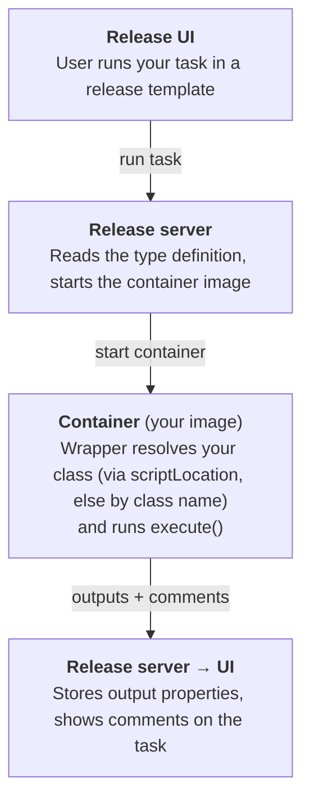

# Plugin Development Guide

A practical guide to building Digital.ai Release **container plugins** with this template.
It explains how the pieces fit together, how to add your own task, and how each
bundled example was built.

> [!TIP]
> New here? Read [How a container plugin works](#how-a-container-plugin-works) first,
> then jump to [Add a new task — step by step](#add-a-new-task--step-by-step).
>
> **AI agents:** start with [AGENTS.md](AGENTS.md) for the conventions and guardrails, then
> use the [`SKILL.md`](SKILL.md) skill (covers setup, adding a task, and build/deploy). This
> guide is the detailed reference behind both.

## Contents

- [How a container plugin works](#how-a-container-plugin-works)
- [The two building blocks](#the-two-building-blocks)
- [The naming contract: type ↔ class](#the-naming-contract-type--class)
- [Anatomy of a task](#anatomy-of-a-task)
- [Choosing a base class: `BaseTask` vs `ApiBaseTask`](#choosing-a-base-class-basetask-vs-apibasetask)
- [Property kinds reference](#property-kinds-reference)
- [Add a new task — step by step](#add-a-new-task--step-by-step)
- [The example tasks explained](#the-example-tasks-explained)
- [Testing your task](#testing-your-task)
- [Build, install, run](#build-install-run)
- [The development environment](#the-development-environment)
- [Troubleshooting](#troubleshooting)
- [Production deployment (Kubernetes)](#production-deployment-kubernetes)
- [Related resources](#related-resources)

## How a container plugin works

A container plugin contributes new **task types** to Release. When a user runs one of
your tasks, Release does roughly this:



1. **Type definition** ([`resources/type-definitions.yaml`](../resources/type-definitions.yaml))
   tells Release the task exists, what inputs/outputs it has, and which container image to run.
2. **Build** (`build.sh` / `build.bat`) produces two artifacts: a **plugin zip** (the type
   definitions + icons) installed into Release, and a **Docker image** (your `src/` code)
   pushed to a registry.
3. **At run time**, Release starts the image as a container. The entrypoint
   (`python -m digitalai.release.integration.wrapper`, see the [`Dockerfile`](../Dockerfile))
   receives the task's input properties, resolves the matching Python class — from the
   task's `scriptLocation` if set, otherwise by class name (see
   [The naming contract](#the-naming-contract-type--class)) — calls its `execute()` method,
   and sends the output properties and comments back to Release.

You write two things: the **type definition** (YAML) and the **task class** (Python).
The SDK wrapper handles everything in between.

## The two building blocks

### 1. The type definition (`resources/type-definitions.yaml`)

Declares the task to Release. Minimal example:

```yaml
types:
  containerExamples.Hello:
    extends: containerExamples.BaseTask     # inherits the image location + styling
    description: "Simple greeter task"

    input-properties:
      yourName:
        description: The name to greet
        kind: string
        default: World

    output-properties:
      greeting:
        kind: string
```

All tasks in this project extend `containerExamples.BaseTask`, a `virtual` (abstract)
type that sets the container image once for every task:

```yaml
  containerExamples.BaseTask:
    extends: xlrelease.ContainerTask
    virtual: true
    hidden-properties:
      image:
        default: "@registry.url@/@registry.org@/@project.name@:@project.version@"
        transient: true
      iconLocation: test.png
      taskColor: "#667385"
```

The `@...@` placeholders are filled in from [`project.properties`](../project.properties) by
the build script, so the image tag always matches what you just built.

#### YAML or XML — both are supported

This template uses `type-definitions.yaml`, but Release also accepts the classic
`type-definitions.xml` format. The same `Hello` type (and its base task) in
XML looks like this:

```xml
<synthetic xmlns:xsi="http://www.w3.org/2001/XMLSchema-instance"
           xmlns="http://www.xebialabs.com/deployit/synthetic"
           xsi:schemaLocation="http://www.xebialabs.com/deployit/synthetic synthetic.xsd">

  <!-- Abstract base task: sets the container image + styling for every task -->
  <type type="containerExamples.BaseTask" extends="xlrelease.ContainerTask" virtual="true">
    <property name="image" hidden="true" transient="true"
              default="@registry.url@/@registry.org@/@project.name@:@project.version@"/>
    <property name="iconLocation" hidden="true" default="test.png"/>
    <property name="taskColor" hidden="true" default="#667385"/>
  </type>

  <type type="containerExamples.Hello" extends="containerExamples.BaseTask" description="Simple greeter task">
    <property name="yourName" category="input" kind="string" default="World" description="The name to greet"/>
    <property name="greeting" category="output" kind="string"/>
  </type>
</synthetic>
```

Both formats express the same things; the mapping is mechanical:

| YAML | XML |
|------|-----|
| `containerExamples.Hello:` (map key) | `<type type="containerExamples.Hello" …>` |
| `extends: …` | `extends="…"` attribute |
| `virtual: true` | `virtual="true"` attribute |
| `input-properties:` / `output-properties:` blocks | `category="input"` / `category="output"` on each `<property>` |
| `hidden-properties:` | `<property … hidden="true"/>` |
| `kind: string`, `default:`, `required:` | `kind="string"`, `default="…"`, `required="true"` attributes |
| enum options | `<property … kind="enum"><enum-values><value label="…">val</value></enum-values></property>` |

> [!IMPORTANT]
> Definition files are **merged**, so each type must be declared in **one** file only — don't
> define the same type in both YAML and XML.

> [!TIP]
> The task class and the [naming contract](#the-naming-contract-type--class) are **identical**
> whichever format you pick — XML changes only how the *type* is declared, not the Python.

### 2. The task class (`src/`)

A Python class that does the work:

```python
from digitalai.release.integration import BaseTask

class Hello(BaseTask):

    def execute(self) -> None:
        name = self.input_properties['yourName']
        if not name:
            raise ValueError("The 'yourName' field cannot be empty")

        greeting = f"Hello {name}"
        self.add_comment(greeting)                 # shows in the task's UI comments
        self.set_output_property('greeting', greeting)
```

## The naming contract: type ↔ class

This is the one rule you must get right. Release sends the **task type** (e.g.
`containerExamples.Hello`) to the container, and the wrapper
(`digitalai/release/integration/wrapper.py`) always derives the **class name** from the part
of the type **after the dot** → `Hello`. How it finds the *file* depends on whether the task
sends a `scriptLocation` property:

**1. `scriptLocation` set** — explicit, deterministic. The wrapper imports exactly
`src/<scriptLocation>` and requires a class named after the dot (`Hello`) to live in that file.
A missing file or a missing class is an error — there is no fallback search.

**2. `scriptLocation` not set** — convention-based fallback. The wrapper walks the whole image,
AST-parses every `.py`, and uses the **first** file that defines a class named `Hello`.

```
  type-definitions.yaml          src/hello.py
  containerExamples.Hello   ⇄    class Hello(BaseTask)
                    └── must match the class name exactly ──┘
```

Consequences:

- **The class name after the dot must match exactly** (case-sensitive), in both modes.
- **The file name only matters when `scriptLocation` is set** — then it must point at the exact
  file under `src/`. Without it, `Hello` could live in `src/anything.py`; by convention we name
  the file after the task, but the fallback resolves by class name.
- **Keep class names unique** across `src/` — in fallback mode resolution is by class name and
  the first match wins.

## Anatomy of a task

Every task subclasses `BaseTask` and implements **`execute(self) -> None`**. Inside it you
have these helpers (from `digitalai.release.integration.BaseTask`):

| Member | Purpose |
|--------|---------|
| `self.input_properties` | `dict` of the task's input properties, keyed by the names in `input-properties`. |
| `self.set_output_property(name, value)` | Set an output property (must be declared in `output-properties`). Allowed value types: `str`, `int`, `list`, `dict`, `bool`. |
| `self.get_output_properties()` | The current output properties `dict`. |
| `self.add_comment(text)` | Add a line to the task's **Comments** section in the UI. |
| `self.set_status_line(text)` | Set the task's status line. |
| `self.get_release_api_client(...)` | Build a `ReleaseAPIClient` to call the Release REST API (see below). |
| `raise ...` | Raising any exception fails the task; the message is shown to the user. |

**Lifecycle:** Release calls `execute_task()`, which sets up the output context and calls
your `execute()`. If `execute()` raises, the task is marked failed and the exception
message becomes the error message — you do **not** need to catch-and-report yourself.

## Choosing a base class: `BaseTask` vs `ApiBaseTask`

**`ApiBaseTask` extends `BaseTask`** — it *is* a `BaseTask` with the Release REST API
pre-wired on top. So everything in [Anatomy of a task](#anatomy-of-a-task)
(`self.input_properties`, `set_output_property`, `add_comment`, …) is available on both;
`ApiBaseTask` just adds the API wrappers and helpers below.

| | `BaseTask` | `ApiBaseTask` |
|--|------------|---------------|
| Import | `from digitalai.release.integration import BaseTask` | `from digitalai.release.integration import ApiBaseTask` |
| Inheritance | base class | subclass of `BaseTask` |
| Use when | The task only talks to a third-party system and never needs to call back into Release. | The task talks to a third-party system **and** needs Release API methods (read/update the release, tasks, variables, …) — or calls the Release API at all. |
| Release API access | Manual: `client = self.get_release_api_client()`, then build each API object yourself. | Ready-made: `self.releaseApi`, `self.phaseApi`, `self.taskApi`, `self.templateApi`, … plus convenience helpers (see below). |

**When in doubt, pick `ApiBaseTask`.** The API client and each wrapper are created lazily
and cached, so you pay nothing until you actually touch the API — there is no penalty for
subclassing it "just in case" you later need a Release call.

### What `ApiBaseTask` gives you

`ApiBaseTask` exposes **every** Release v1 API as a lazily created, cached property
(`releaseApi`, `phaseApi`, `taskApi`, `folderApi`, `configurationApi`, `templateApi`,
`variableApi`, … — one per `com.xebialabs.xlrelease.api.v1` wrapper). All of them share a
single `ReleaseAPIClient` built from the task's **"Run as user"** context, so you just call:

```python
from digitalai.release.integration import ApiBaseTask

class ShowTitle(ApiBaseTask):
    def execute(self) -> None:
        release = self.releaseApi.getRelease(self.get_release_id())
        self.add_comment(f"Working on {release.title}")
```

On top of the raw wrappers, it adds **current-context** and **variable** helpers that resolve
the right id from the task's own context (so you don't pass ids around) — e.g.
`getCurrentRelease()`, `getReleaseVariable(name)` / `setReleaseVariable(name, value)`, and the
folder/global variable equivalents. For the full list of wrappers and helpers, see the
**[`ApiBaseTask` reference](https://github.com/digital-ai/release-integration-sdk-python/blob/main/docs/classes/api_base_task.md)**.

> [!IMPORTANT]
> **"Run as user" matters.** API calls execute as the release's Run-as user. If that user
> is not set or lacks permission, API calls fail. For local testing, the dev-environment
> server (`localhost:5516`, `admin`/`admin`) has a working runner.

## Property kinds reference

The common `kind` values used in `input-properties` / `output-properties`:

| `kind` | Python type you receive | Notes |
|--------|-------------------------|-------|
| `string` | `str` | Plain text. Add `default:` for a default value. |
| `integer` | `int` | Whole number. |
| `boolean` | `bool` | Checkbox. |
| `date` | `str` (ISO-8601) | Date/time value. |
| `map_string_string` | `dict[str, str]` | Key/value pairs. |
| `list_of_string` | `list[str]` | List of strings. |
| `ci` | `dict` | A reference to a configuration item; use `referenced-type:` to constrain it (e.g. a server connection). |

Other useful field options:

- `description:` — shown as help text in the UI.
- `default:` — pre-filled value.
- `required: true` — the UI enforces a value.
- `hidden-properties:` — properties not shown to the user (e.g. the container `image`).
- `input-hint: { method-ref: ... }` — drives a dropdown from a **lookup** script (see
  `HelloWithLookup` below).

A **server connection** is just a CI type that extends a Release connection type, so users
can pick a saved connection:

```yaml
  containerExamples.Server:
    extends: configuration.BasicAuthHttpConnection
    properties:
      url:
        default: https://dummyjson.com
        required: true
```

## Add a new task — step by step

Suppose you want a task that reverses a string.

**1. Declare the type** in [`resources/type-definitions.yaml`](../resources/type-definitions.yaml):

```yaml
  containerExamples.Reverse:
    extends: containerExamples.BaseTask
    description: "Reverses the given text"
    input-properties:
      text:
        kind: string
        required: true
    output-properties:
      reversed:
        kind: string
```

**2. Write the class** in `src/reverse.py` — class name **must** be `Reverse` (matches the
type after the dot):

```python
from digitalai.release.integration import BaseTask

class Reverse(BaseTask):
    def execute(self) -> None:
        text = self.input_properties['text']
        if not text:
            raise ValueError("The 'text' field cannot be empty")
        self.set_output_property('reversed', text[::-1])
```

**3. Write a test** in `tests/unit/test_reverse.py` (see [Testing your task](#testing-your-task)).

**4. Build & install** — bump `VERSION` in `project.properties`, then run the build
(see [Build, install, run](#build-install-run)). Add the task to a template and run it.

That's the whole loop: **declare → implement → test → build → run.**

## The example tasks explained

The template ships a set of examples, each demonstrating one capability. Use them as
starting points.

| Type (YAML) | Class (`src/`) | Base class | Demonstrates |
|-------------|----------------|------------|--------------|
| `containerExamples.Hello` | `Hello` ([hello.py](../src/hello.py)) | `BaseTask` | The minimal task: read an input, set an output, add a comment. |
| `containerExamples.ServerQuery` | `ServerQuery` ([server_query.py](../src/server_query.py)) | `BaseTask` | Calling a **third-party** HTTP API using a `ci` server connection for the URL/credentials. |
| `containerExamples.TestConnection` | `TestConnection` ([test_connection.py](../src/test_connection.py)) | `BaseTask` | A **test-connection** script for a server CI: returns `{success, output}` in `commandResponse`. |
| `containerExamples.SetSystemMessage` | `SetSystemMessage` ([set_system_message.py](../src/set_system_message.py)) | `BaseTask` | Calling the **Release** REST API the manual way via `get_release_api_client()`. |
| `containerExamples.CreateAndStartRelease` | `CreateAndStartRelease` ([create_and_start_release.py](../src/create_and_start_release.py)) | `ApiBaseTask` | Orchestrating the Release API with the ready-made `templateApi` / `releaseApi` / `phaseApi` / `taskApi` wrappers. |
| `containerExamples.NameLookup` | `NameLookup` ([name_lookup.py](../src/name_lookup.py)) | `BaseTask` | A **lookup** script that returns `{label, value}` options for a dropdown. |
| `containerExamples.HelloWithLookup` | `HelloWithLookup` ([hello_with_lookup.py](../src/hello_with_lookup.py)) | `BaseTask` | An input whose value is chosen from a lookup (`input-hint.method-ref`). |

### How the key examples were built

**`Hello` — the baseline.** Reads `input_properties['yourName']`, validates it, builds a
greeting, surfaces it with `add_comment`, and returns it via `set_output_property`. Every
other task follows this same shape.

**`ServerQuery` — third-party API + connection CI.** The `server` input is a `ci` referencing
`containerExamples.Server` (a `BasicAuthHttpConnection`). The task reads `url`/`username`/
`password` from that dict and uses `requests` to call the service. This is the pattern for
integrating any external system: model the connection as a CI, call it with `requests`.

**`TestConnection` — validating a connection.** Registered on the `Server` CI as its
`testConnectionScript`, so the **Test** button in the connection dialog runs it. It returns
a `commandResponse` map with `success` and `output`, the shape Release expects.

**`SetSystemMessage` — Release API, manual client.** A `BaseTask` that calls
`self.get_release_api_client()` and issues a raw `client.put("/api/v1/config/...", json=...)`.
Use this when you want full control of the HTTP call.

**`CreateAndStartRelease` — Release API, the easy way.** An `ApiBaseTask` that chains the
typed wrappers: `templateApi.createTemplate` → `templateApi.create` → `releaseApi.getRelease`
→ `phaseApi.updatePhase` → `taskApi.addTask` → `releaseApi.start`. It deliberately adds a
legacy `xlrelease.ScriptTask` to demonstrate creating built-in Release tasks through the API.
Prefer this over the manual client whenever you work with the Release API.

**`NameLookup` + `HelloWithLookup` — dynamic dropdowns.** `NameLookup` returns a list of
`{label, value}` entries as `commandResponse`. `HelloWithLookup` wires its `yourName` input
to that script via `input-hint.method-ref`, so the field becomes a populated dropdown.

## Testing your task

Tasks are plain Python classes, so you can unit-test them without a server by setting
`input_properties` and calling `execute_task()` (or `execute()` directly). Mock the API
client / `requests` to keep unit tests offline.

```python
from src.reverse import Reverse

def test_reverse():
    task = Reverse()
    task.input_properties = {'task_id': 'task_1', 'text': 'abc'}
    task.execute_task()
    assert task.get_output_properties()['reversed'] == 'cba'
```

Tests live in [`tests/unit/`](../tests/unit/) (fast, mocked) and [`tests/integration/`](../tests/integration/)
(networked tests; Release-backed tests auto-skip when no server is reachable, while
third-party service tests require internet access). Run them with:

```sh
uv run pytest               # everything
uv run pytest tests/unit    # fast unit tests only
```

See the [README — Run the tests](../README.md#run-the-tests) for the full workflow, including
the `RELEASE_*` environment variables for integration tests.

## Build, install, run

The full build/install/run instructions live in the README:

- [Run Release locally](../README.md#run-release-locally)
- [Build & publish](../README.md#build--publish)
- [Install the plugin into Release](../README.md#install-the-plugin-into-release)

The short version: bump `VERSION` in [`project.properties`](../project.properties), run
`./build.sh` (or `build.bat`) to build the zip + image and push the image, then
`./build.sh --upload` to install the zip into Release. Add your task to a template and run it.

## The development environment

The [`docker-compose.yaml`](../docker-compose.yaml) stack (with its build contexts and config in
[`dev-environment/`](../dev-environment/)) runs a complete local Release setup to test plugins against:

| Service | Port | Purpose |
|---------|------|---------|
| `digitalai-release` | `5516` | Release server (login `admin` / `admin`). |
| `digitalai-release-setup` | — | Applies the initial instance configuration, then exits. |
| `digitalai-release-remote-runner` | — | Runs container tasks in Docker mode (uses `network_mode: host`). |
| `container-registry` | `5050` | Docker registry that holds your plugin images. |
| `container-registry-ui` | `8086` | Web UI for the registry. |

Start it and wait for the Release log line `Digital.ai Release has started.`, then open
<http://localhost:5516>:

```sh
docker compose up -d --build
```

**Hosts file.** The registry is addressed by name, so the image you push (`container-registry:5050/...`)
resolves both when building and when Release pulls it. Add to `/etc/hosts` (Unix/macOS) or
`C:\Windows\System32\drivers\etc\hosts` (Windows, as administrator):

```
127.0.0.1 container-registry
```

The compose stack also uses `host.docker.internal` (the server's `SERVER_URL`). Docker Desktop
(macOS/Windows) provides this automatically; on Linux add `127.0.0.1 host.docker.internal` too.

**Reset** (clears server state — fixes most "stuck" issues):

```sh
docker compose down
docker compose up -d --build
```

## Troubleshooting

| Symptom | Cause / fix |
|---------|-------------|
| Release won't start: `Trying to register duplicate definition for type ...` | A type is defined twice (often a leftover from a previous install). **Reset** the dev environment. |
| Release log stuck at `Waiting for changelog lock...` | Stale DB lock. **Reset** the dev environment. |
| `Could not find a type definition associated with type [...]` | A type name or an `extends:` reference in `type-definitions.yaml` is inconsistent. Make the names match; reset if needed. |
| Your task is missing from the **Add task** menu, or its properties don't show | First confirm the plugin uploaded: **Manage plugins** → **Installed plugins** (<http://localhost:5516/#/pluginManager>). If it is listed, this is UI cache — hard-refresh the browser (Ctrl/Cmd+Shift+R). No server restart needed. |
| Class-not-found at run time | The [naming contract](#the-naming-contract-type--class) is broken: the type name after the dot must equal a class name under `src/`. |
| Image push fails | `container-registry` is not in your hosts file, or the registry container is down. Check `curl http://container-registry:5050/v2/_catalog`. |
| Unit test fails with `KeyError` on an output property | `execute()` raised before setting outputs. Read the traceback in the pytest output for the real error. |
| Apple Silicon: `qemu: uncaught target signal 11` | Enable **Rosetta** in Docker Desktop → *Features in development*. |
| Compose fails to start | Port conflict on `5516`, `5050`, or `8086` (or `4566` if you add Localstack). Free the port or remap it. |

## Production deployment (Kubernetes)

In production, container tasks run on a Kubernetes cluster via the **Release Runner**, which
registers itself with the Release server over an **outbound** connection (no inbound access to
the cluster needed) and launches a **pod** from your plugin's image for each task.

The plugin you build here is unchanged — only *where the image runs* differs from the local
Docker-mode runner. Just make sure your image is in a registry the cluster can pull from. See
the Digital.ai Release documentation for the Runner installation steps.

## Related resources

See [README → Related resources](../README.md#related-resources).
